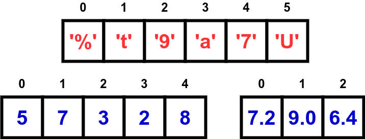

# 6. Vetores

Um vetor, também chamado de *array*, é um tipo de estrutura de dados que permite armazenar e acessar um conjunto de elementos de mesmo tipo usando um índice, representado por um valor inteiro.

6.1. [Definição](definicao.md)

6.2. [Ponteiros](ponteiros.md)

## Exercícios Resolvidos

6.1. [Beecrowd 2328 - Chocolate](https://www.beecrowd.com.br/judge/en/problems/view/2328) [[Solução](iteracao/beecrowd_2328.py)]
 
6.2. [Beecrowd 2807 - Iccanobif](https://www.beecrowd.com.br/judge/en/problems/view/2807) [[Solução](listas/beecrowd_2807.py)]
   
6.3. [Beecrowd 2345 - Assigning Teams](https://www.beecrowd.com.br/judge/en/problems/view/2345) [[Solução](listas/beecrowd_2345.py)] *dá para fazer sem listas*
   
6.4. [Beecrowd 1259 - Even or Odd](https://www.beecrowd.com.br/judge/en/problems/view/1259) [[Solução](listas/beecrowd_1259.py)]
   
6.5. [Beecrowd 1375 - Pole Position](https://www.beecrowd.com.br/judge/en/problems/view/1375) [[Solução](listas/beecrowd_1375.py)]

## Aula Prática

