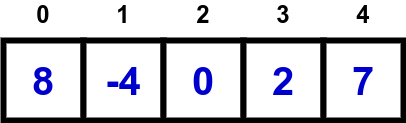

# 7.1. Princípios Básicos

## Representação de Vetores

Um vetor é uma estrutura de dados em que cada elemento estará associado com uma posição, ou índice, como mostra a figura abaixo:



Com essa estrutura de dados, é possível ter acesso rápido e sequencial dos dados.

**Jargão:** vetores são também conhecidos como *arrays* no mundo da programação.

## Declaração de Vetores

Para declarar um vetor em C, deve-se especificar o tipo de dado dos elementos e o tamanho **máximo** do vetor no seguinte formato:

```
tipo_de_dados nome_da_variavel[TAMANHO_MAX_DO_VETOR];
```

em que:

- ```tipo_de_dados```: é um dos tipos ```int```, ```float```, ```double```, ```long long int```, ```char```, ou algum outro tipo definido pelo usuário;
- ```nome_da_variavel```: é o nome da variável, criado nos mesmos moldes das variáveis tradicionais;
- ```TAMANHO_MAX_DO_VETOR```: é um número inteiro indicando o tamanho máximo de elementos que o vetor pode armazenar. Não é um problema utilizar menos elementos do que o tamanho declarado para a sua capacidade máxima.

O trecho de código-fonte a seguir exemplifica a declaração de uma variável vetor capaz de armazenar até 10 valores inteiros:

```
int arr[10];
```

O exemplo a seguir mostra a declaração de vetores para outros tipos de dados:

```
double arrd[5];
long long int arr[15];
```

### Alocação Estática de Memória (Detalhe Técnico)

O tipo de declaração acima aloca o espaço em memória para ser utilizado no armazenamento dos elementos nos vetores em tempo de compilação, isto é, no momento em que o compilador GCC analisa o código-fonte e gera o arquivo executável associado. Essa abordagem é conhecida como **alocação estática de memória**. Por isso, alguns materiais denotam esses tipos de vetores como **vetores estáticos**.

## Inicialização de Vetores

Você pode inicializar um vetor contendo alguns elementos ao declará-lo da seguinte maneira:

```
int arr[5] = {8,-4,0,2,7};
```

## Acessando Elementos de Vetores

Como falado anteriormente, os elementos do vetor são acessados usando índices. No exemplo abaixo, o elemento armazenado no índice ```0``` do vetor é acessado:

```
int idx;
int arr[5] = {8,-4,0,2,7};
idx = 0;
printf("arr[%d] = %d\n",idx,arr[idx]);
```

Acontece que à medida em que a quantidade de elementos armazenados no vetor aumenta, torna-se mais difícil acessar individualmente cada índice do vetor para inicializá-lo ou imprimir seus valores. Veja como o código-fonte a seguir fica ruim esteticamente:

```
#include<stdio.h>

int main(){
    int i;
    int arr[5];

    arr[0] = 3;
    arr[1] = 5;
    arr[2] = 0;
    arr[3] = -2;
    arr[4] = 7;

    printf("arr[%d] = %d\n",0,arr[0]);
    printf("arr[%d] = %d\n",1,arr[1]);
    printf("arr[%d] = %d\n",2,arr[2]);
    printf("arr[%d] = %d\n",3,arr[3]);
    printf("arr[%d] = %d\n",4,arr[4]);

    return 0;
}
```

Para generalizar operações de leitura, escrita, consulta e alteração em vetores, o laço **for** é uma excelente opção:

```
#include<stdio.h>

int main(){
    int i;
    int arr[5] = {8,-4,0,2,7};

    for(i = 0; i < 5; i++){
        printf("arr[%d] = %d\n",i,arr[i]);
    }

    return 0;
}
```

## Leitura de n valores da entrada

Uma das operações mais comuns ao se resolver problemas é ler ```n``` valores da entrada e armazená-los em um vetor. Para isso, faremos as seguintes operações:

- Criaremos uma variável **n** para denotar a quantidade de valores inteiros que, de fato, serão lidos da entrada. Observe que ```n <= 1000```;
- Utilizaremos a função ```scanf``` para ler um valor inteiro da entrada e armazenar em uma posição do vetor. Como temos que ler ```n``` valores inteiros da entrada, devemos repetir essa operação de leitura **n** vezes. Vamos usar uma estrutura de repetição para esse propósito.

```
#include<stdio.h>

int main(){
    int i,n;

    int arr[1000];

    scanf("%d",&n);

    for(i = 0; i < n; i++){
        scanf("%d",&arr[i]);
    }
    
    for(i = 0; i < n; i++){
        printf("arr[%d] = %d\n",i,arr[i]);
    }
    printf("\n");

    return 0;
}
```

## O Problema do Lixo de Memória

Começamos essa seção com uma pergunta: ao se declarar um vetor, quais são os valores iniciais em cada uma de suas posições? Se você pensou *"zero"*, você errou. A resposta é: **lixo de memória**!

Veja o código-fonte abaixo:

```
#include<stdio.h>

int main(){
    int i;
    int v[5];

    for(i = 0; i < 5; i++){
        printf("%d ",v[i]);
    }
    printf("\n");

    return 0;
}
```

Ao executá-lo, você provavelmente verá uma resposta parecida como:

```
0 0 0 0 0
```

Se você obteve a saída acima, é provável que você esteja rodando o código-fonte em um ambiente de desenvolvimento que aplica proteções de segurança ou inicialização automática de variáveis locais.

Por outro lado, você pode obter uma saída como essa:

```
-723563 -723563 -723563 -723563 -723563
```

Bom, o que ocorre é que o comportamento é **inesperado**! As posições de ```v``` **não** são automaticamente zeradas, fazendo com que elas contenham valores indefinidos, chamados popularmente de "lixo de memória", ou seja, resíduos que estavam naquela posição da memória antes da declaração.

Se você realizar operações aritméticas no seu vetor em que seus elementos são lixo de memória, seu programa poderá apresentar comportamento indefinido devido a cálculos incorretos em cima dos valores desse lixo de memória. Para evitar o lixo de memória, sempre inicialize seu vetor com elementos neutros:

```
for(i = 0; i < 5; i++){
    v[i] = 0;
}
```

ou de maneira simplificada, no exato momento da declaração do vetor (e somente na declaração do vetor):

```
int v[5] = {0};
```

## Observações

### Acessar índice indevido

É importante observar que o acesso de um elemento por meio de um **índice inválido** em relação ao tamanho do vetor **não** resulta em erro de compilação. Isso ocorre porque a função do compilador é de encontrar possíveis erros de sintaxe no código-fonte e o uso de um índice indevido não configura um tipo de erro como esse.

Compile o código-fonte a seguir e veja o que ocorre:

```
#include<stdio.h>

int main(){
    int i,idx;

    int arr[10];
    idx = 14;
    arr[idx] = 6;

    printf("arr[%d] = %d\n",idx,arr[idx]);

    return 0;
}
```
