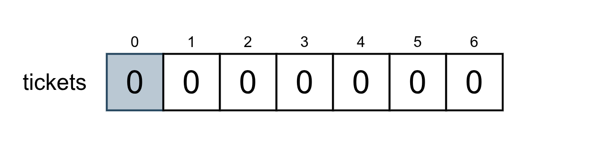
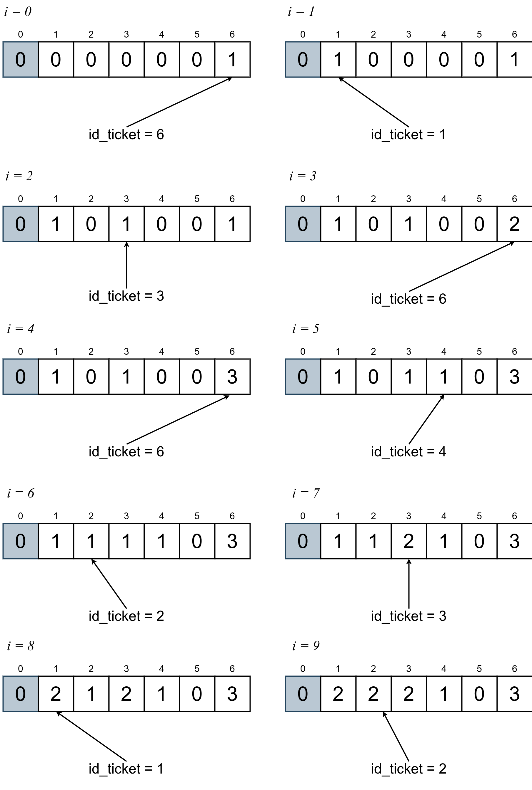

# Beecrowd 1318 - Fake Tickets

## Enunciado

Disponível [aqui](https://judge.beecrowd.com/pt/problems/view/1318).

## Requisitos para Resolução do Problema

Estruturas de repetição, vetores. Uso de vetores como um histograma ou distribuição de frequência

## Raciocínio

Devemos determinar quantos bilhetes falsos existem em um conjunto de bilhetes coletados em uma festa (ou formatura?). Considera-se que um bilhete foi falsificado quando existem mais de uma cópia dele no conjunto desses bilhetes coletados na festa.

Sabemos que:

1) Os bilhetes possuem


## Implementação

Suponha a entrada:

```
6 10
6 1 3 6 6 4 2 3 1 2
```

em que *n=6*, *m=10*. Como os tickets possuem valor de *1* a *n*,  vamos declarar um vetor de inteiros como se segue:

```
int tickets[10001];
```

O índice zero do vetor não será utilizado. Para cada caso de teste, vamos inicializar suas posições com zeros:

```
for(i = 1; i <= n; i++){
    tickets[i] = 0;
}
```

Com isso, teremos o vetor dessa maneira:



Agora vamos ler a entrada dos *m* tickets coletados na festa

```
for(i = 0; i < m; i++){
    scanf("%d",&id_ticket);
    tickets[id_ticket]++;
}
```

Esse processo é ilustrado abaixo:



```
#include<stdio.h>

int solve(int n, int m){
    int i,id_ticket,falsos;
    int tickets[10001];

    for(i = 1; i <= n; i++){
        tickets[i] = 0;
    }

    for(i = 0; i < m; i++){
        scanf("%d",&id_ticket);
        tickets[id_ticket]++;
    }

    falsos = 0;

    for(i = 1; i <= n; i++){
        if(tickets[i] > 1){
            falsos++;
        }
    }
    return falsos;
}

int main(){

    int n,m,ans;

    scanf("%d %d",&n,&m);

    while(n != 0 && m != 0){
        ans = solve(n,m);
        printf("%d\n",ans);
        scanf("%d %d",&n,&m);
    }

    return 0;
}
```

