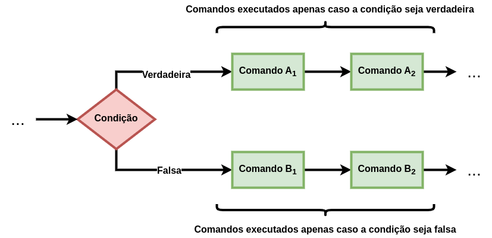

# 4. Estruturas Condicionais

Uma estrutura condicional em Linguagem C permite ao algoritmo computacional a tomada de decisões, isto é, a execução de comandos, expressões e instruções que satisfazem uma condição determinada. Especificamente, o algoritmo executa um bloco de comandos, expressões e instruções quando uma condição especificada for verdadeira e, opcionalmente, um outro bloco de código distinto se a condição for falsa.

Observe na Figura acima que uma condição retorna sempre, ou um valor **verdadeiro**, ou um valor **falso**. A ideia é justamente elaborar um fluxo de comandos, expressões e instruções, para cada um desses casos, sendo o caso verdadeiro sempre obrigatório.

Na Linguagem C, existem dois tipos de estruturas condicionais: **if-else** e **switch-case**. Elas são detalhadas nas subseções seguintes após trabalharmos a criação de comparações para elaboração das condições.

4.1. [Operações de Comparação](comparacao.md)

4.2. [Estrutura If-Else](ifelse.md)

4.3. [Estrutura Switch-Case](switchcase.md)

## Exercícios Resolvidos

4.4. [Beecrowd 2375 - Sedex](https://judge.beecrowd.com/pt/problems/view/2375) [[Solucão](beecrowd_2375.md)]

4.5. [Beecrowd 1041 - Coordenadas de um Ponto](https://judge.beecrowd.com/pt/problems/view/1041) [[Solucão](beecrowd_1041.md)]

## Aula Prática (12/04/2024)

4.7. [Beecrowd 1048 - Aumento de Salário](https://judge.beecrowd.com/pt/problems/view/1048) [[Solucão](beecrowd_1048.c)]

4.8. [Beecrowd 1051 - Imposto de Renda](https://judge.beecrowd.com/pt/problems/view/1051) [[Solucão](beecrowd_1051.c)]

4.9. [Beecrowd 2456 - Cartas](https://judge.beecrowd.com/pt/problems/view/2456) [[Solucão](beecrowd_2456.c)]

4.10. [Beecrowd 2579 - Nagol](https://judge.beecrowd.com/pt/problems/view/2579) [[Solucão](beecrowd_2579.c)]

4.11. [Beecrowd 3049 - Nota Cortada](https://judge.beecrowd.com/pt/problems/view/3049) [[Solucão](beecrowd_3049.c)]

