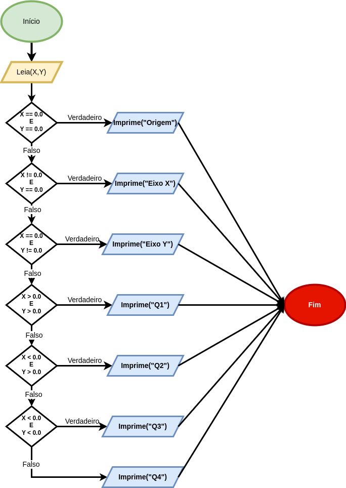

# Exercícios Resolvidos

## Beecrowd 1041 - Coordenadas de um Ponto

### Enunciado

Disponível [aqui](https://judge.beecrowd.com/pt/problems/view/1041).

### Requisitos para Resolução do Problema

Variáveis, leitura e escrita de dados, e estruturas condicionais.

### Raciocínio

O exercício é fácil de entender, mas a construção do código-fonte pode gerar dúvidas. A principal questão é: "por onde começar?".

Primeiramente, vamos ler a entrada, que são dois valores de ponto flutuante ```x``` e ```y``` separados por espaço. Para a resolução desse problema, variáveis do tipo ```float``` já são suficientes, pois não será necessário fazer operações aritméticas, o que nos poderia trazer problemas de precisão. Entretanto, não há problemas em se utilizar variáveis do tipo ```double```.

A resolução desse problema vai envolver tomada de decisão: temos que verificar onde o ponto *(x,y)* se encontra no plano cartesiano. Vamos mapear cada caso:

- Se ```x``` é igual a zero e ```y``` é igual a zero, então esse ponto está na origem!
- Caso contrário, se ```x``` é diferente de zero e ```y``` é igual a zero, então esse ponto está no Eixo Y;
- Caso contrário, se ```x``` é igual a zero e ```y``` é diferente de zero, então esse ponto está no Eixo X;
- Caso contrário, se ```x``` é maior do que zero e ```y``` é maior do que zero, então esse ponto está no Quadrante 1 (Q1);
- Caso contrário, se ```x``` é menor do que zero e ```y``` é maior do que zero, então esse ponto está no Quadrante 2 (Q2);
- Caso contrário, se ```x``` é menor do que zero e ```y``` é menor do que zero, então esse ponto está no Quadrante 3 (Q3);
- Por fim, se nenhuma das condições acima for satisfeita, então esse ponto estará no Quadrante 4 (Q4);

Como pode-se ver, a resposta da questão "por onde começar?" está relacionada com a ordem com que você coloca as regras. A ordem não importa, desde que você construa corretamente a estrutura condicional. No caso acima, decidimos começar pelos casos em que alguma das variáveis, ou ambas, são iguais a zero, para depois cuidarmos dos casos dos quadrantes.

Se colocarmos as regras acima como se fosse um fluxograma, teríamos então:

.

### Implementação com If-Else

Primeiramente, colocamos a estrutura básica de um programa em linguagem C, considerando que faremos operações de ler dois números reais da entrada padrão e imprimir a resposta para o problema. Assim, criamos a função principal e a diretiva para incluir a biblioteca ```stdio.h``` visando utilizar as funções de leitura (```scanf```) e escrita (```printf```). Depois devemos declarar as variáveis que precisaremos para armazenar os valores ```x``` e ```y```:

```
#include<stdio.h>

int main(){

  double x,y;

  scanf("%lf %lf",&x,&y);

  

  return 0;
}
```

Vamos modelar a primeira regra, isto é, se ```x``` é igual a zero e ```y``` é igual a zero. Se para dois valores ```x``` e ```y``` o resultado da comparação for verdadeiro, então deve-se imprimir que esse ponto está na origem:

```
#include<stdio.h>

int main(){

  double x,y;

  scanf("%lf %lf",&x,&y);

  if(x == 0.0 && y == 0.0){
    printf("Origem\n");
  }

  return 0;
}
```

Agora temos que pensar na estratégia de construção da estrutura condicional. Caso a condição retorne verdadeiro, o ideal e imprimir a mensagem e encerrar o programa. Para esse propósito, implementamos a bloco else:

```
#include<stdio.h>

int main(){

    double x,y;

    scanf("%lf %lf",&x,&y);

    if(x == 0.0 && y == 0.0){
        printf("Origem\n");
    }else{
    
    }

    return 0;
}
```

A ideia então é no bloco else incluir as demais regras que foram mapeadas para cobrir todas as respostas possíveis. Seguindo-se então com a implementação da segunda regra dentro do bloco ```else```, vamos incluir um novo bloco if-else, resultando em:

```
#include<stdio.h>

int main(){

    double x,y;

    scanf("%lf %lf",&x,&y);

    if(x == 0.0 && y == 0.0){
        printf("Origem\n");
    }else{
        if(x != 0.0 && y == 0.0){
            printf("Eixo Y\n");
        }else{
            
        }
    }

    return 0;
}
```

E seguimos com a construção proposta acima para as demais regras, garantido-se que assim que uma das condições seja satisfeita, o programa seja encerrado, evitando-se comparações desnecessárias.

**IMPORTANTE**: seja cuidadoso e capriche na organização da indentação das estruturas if-else aninhadas (uma dentro da outra) para facilitar a interpretação do código-fonte.


#### Código-fonte Final

```
#include<stdio.h>

int main(){

    double x,y;

    scanf("%lf %lf",&x,&y);

    if(x == 0.0 && y == 0.0){
        printf("Origem\n");
    }else{
        if(x != 0.0 && y == 0.0){
            printf("Eixo Y\n");
        }else{
            if(x == 0.0 && y != 0.0){
                printf("Eixo X\n");
            }else{
                if(x > 0.0 && y > 0.0){
                    printf("Q1\n");
                }else{
                    if(x < 0.0 && y > 0.0){
                        printf("Q2\n");
                    }else{
                        if(x < 0.0 && y < 0.0){
                            printf("Q3\n");
                        }else{
                            printf("Q4\n");
                        }
                    }
                }
            }
        }
    }

    return 0;
}
```
