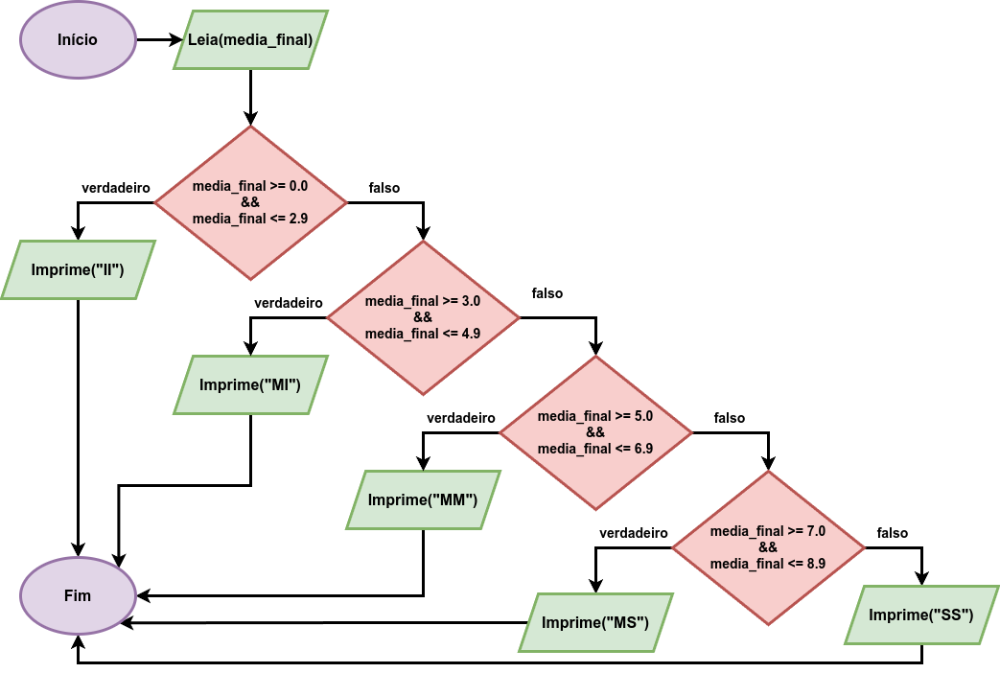
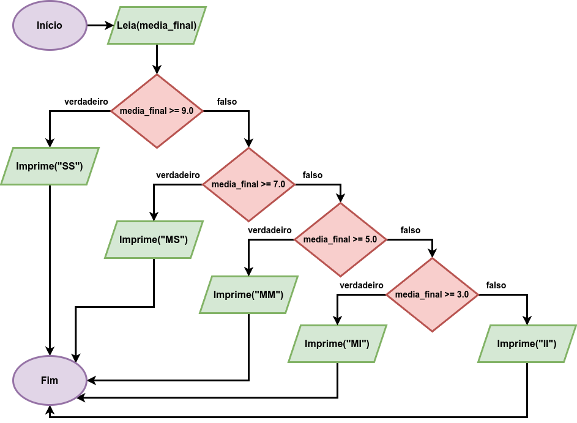

# 4.2. Estrutura If-Else

A estrutura if-else permite controlar o fluxo mais básicas e fundamentais, isto é, a execução de diferentes blocos de comandos, expressões e instruções caso uma condição descrita por uma comparação seja verdadeira ou não.

```
if(CONDICAO){
  /* comandos executados caso CONDICAO retorne um valor verdadeiro */
}else{
 /* comandos executados caso CONDICAO retorne um valor falso */
}
```

```CONDICAO``` é uma expressão que permite avaliar uma condição, sendo descrita por uma comparação ou combinação de comparações. Exemplos de expressões de comparação podem ser encontrados [aqui](comparacao.md). Se ```CONDICAO``` for verdadeira, **apenas** o bloco de código dentro do ```if``` (também chamado de **escopo** do ```if```) é executado. Caso contrário, **apenas** o bloco de código dentro do ```else``` é executado.

Vale lembrar que o bloco **else** é opcional, significando que se a condição do ```if``` for falsa e não houver um bloco ```else```, o programa segue o seu fluxo natural, executando a linha de código após o bloco if-else.

**IMPORTANTE:** coloque indentação (a famosa tecla TAB) dentro dos comandos associados a cada bloco.

No início da sua jornada com estruturas condicionais, pode ser comum colocar várias condicionais If (sem uso de else) como é mostrado no trecho de código-fonte a seguir:

```
/* ... */

int a;

scanf("%d",&a);

if(a % 2 == 0){
    printf("Numero par\n");
}

if(a % 2 != 0){
    printf("Numero impar\n");
}

/* ... */
```

Observe que no caso específico acima, se um número inteiro ```a``` é par, não há como ele ser ímpar. Mas no trecho de código-fonte acima, a condição do segundo comando ```if``` é **desnecessariamente** executada quando o número ```a``` for par. Como a definição de número par ou ímpar é mutuamente exclusiva, você pode usar o bloco ```else``` como mostrado abaixo:

```
/* ... */

int a;

scanf("%d",&a);

if(a % 2 == 0){
    printf("Numero par\n");
}else{
    printf("Numero impar\n");
}

/* ... */
```

## Estrutura If-Else aninhada

Em algumas situações, temos que elaborar um algoritmo em que apenas um, dentre diversos blocos de código, deve ser executado ao satisfazer determinada condição.

Por exemplo, suponha um programa que determina a menção final (de acordo com a Universidade de Brasília) de um discente a partir de sua média final. Considere que a média final é fornecida por um número real com um dígito de precisão na parte fracionária, cujo valor fornecido pela entrada é obrigatoriamente dado por 0.0 <= MF <= 10.0. A Tabela a seguir descreve como é feito o cálculo da menção a partir da média final:

Média Final (MF) | Menção Final |
---------------  | ------- |
0.0 <= MF <= 2.9 | II      |
3.0 <= MF <= 4.9 | MI      |
5.0 <= MF <= 6.9 | MM      |
7.0 <= MF <= 8.9 | MS      |
9.0 <= MF <= 10.0 | SS     |

Observe que temos vários intervalos a serem considerados e que cada intervalo está associado a uma menção. Isso significa que temos que elaborar um bloco de código específico para cada intervalo da tabela. Uma solução **ineficiente** e que você **deve evitar fazer** é elaborar vários blocos **if** separadamente como mostra o código-fonte abaixo (apesar do código-fonte funcionar):

```
/* ATENCAO: Codigo-fonte INEFICIENTE!!! Veja solucao correta mais APROPRIADA abaixo!!! */

#include <stdio.h>

int main() {
    double media_final;

    scanf("%lf", &media_final);

    if (media_final >= 0.0 && media_final <= 2.9) {
        printf("II\n");
    }

    if (media_final >= 3.0 && media_final <= 4.9) {
        printf("MI\n");
    }

    if (media_final >= 5.0 && media_final <= 6.9) {
        printf("MM\n");
    }

    if (media_final >= 7.0 && media_final <= 8.9) {
        printf("MS\n");
    }

    if (media_final >= 9.0 && media_final <= 10.0) {
        printf("SS\n");
    }

    return 0;
}
```

O motivo da ineficiência do código-fonte acima é que todos os blocos ```if``` serão sucessivamente verificados de maneira desnecessária. Por exemplo, suponha que o valor colocado na entrada para a variável ```media_final``` seja ```1.5```.  O primeiro bloco ```if``` é executado, pois a condição ```media_final >= 0.0 && media_final <= 2.9``` vai retornar verdadeiro. Entretanto, pode-se ver que as demais condições retornando falso, pois sabe-se que de acordo com a natureza do problema sendo resolvindo, a média final (```media_final```) vai pertencer a apenas um dos intervalos, e consequentemente, apenas um dos blocos ```if``` será de fato executado.

Vamos reescrever a estrutura acima como blocos if-else como mostra a figura a seguir:



Como resultado, temos que colocar blocos ```if-else``` dentro de outros blocos ```if-else```, caracterizando o bloco **if-else aninhado**.

```
#include <stdio.h>

int main() {
    double media_final;

    scanf("%lf", &media_final);

    if (media_final >= 0.0 && media_final <= 2.9) {
        printf("II\n");
    } else {
        if (media_final >= 3.0 && media_final <= 4.9) {
            printf("MI\n");
        } else {
            if (media_final >= 5.0 && media_final <= 6.9) {
                printf("MM\n");
            } else {
                if (media_final >= 7.0 && media_final <= 8.9) {
                    printf("MS\n");
                } else {
                    printf("SS\n");
                }
            }
        }
    }

    return 0;
}
```

Uma versão do código-fonte acima é reescrita reduzindo-se as comparações das condições e apresentada na sequência. A ideia é aproveitarmos a estrutura do if-else e a ordem com que executamos as condições no bloco if-else completo para trabalhar quando o valor da variável **não ultrapassa** o limite superior do intervalo. Por exemplo, se ```media_final``` é igual a ```3.7```, então sabemos que ```media_final``` é maior do que ```2.9```. Tirando proveito da ordem com que executamos as condições (*observe que as comparações são crescentes em relação ao limite superior de cada intervalo*), a primeira comparação no primeiro ```if``` retorna falso e apenas o bloco ```else``` é então executado. No escopo do bloco ```else```, já existe um outro bloco if-else interno, então fazendo-se a comparação ```media_final <= 4.9```, verifica-se que ela é verdadeira e como resultado, "MI" é gerada na saída e o algoritmo é encerrado, pois o bloco ```else``` não será executado.



Segue o código-fonte

```
#include <stdio.h>

int main() {
    double media_final;

    scanf("%lf", &media_final);

    if (media_final <= 2.9) {
        printf("II\n");
    } else {
        if (media_final <= 4.9) {
            printf("MI\n");
        } else {
            if (media_final <= 6.9) {
                printf("MM\n");
            } else {
                if (media_final <= 8.9) {
                    printf("MS\n");
                } else {
                    printf("SS\n");
                }
            }
        }
    }

    return 0;
}
```

**DESAFIO:** Como exercício, altere algum dos últimos três códigos-fontes para incluir o caso em que o discente recebe a menção SR, isto é, quando a frequência do discente em relação ao total de aulas ministradas é menor do que 75%. Repare que independemente da média final do discente, se não houve cumprimento da frequẽncia mínima de 75%, o discente é reprovado por faltas, independentemente da sua média final. Considere que a frequência é lida juntamente com a media final (separada por espaço em branco) como um número real contendo um único dígito de precisão na parte fracionária.

## Extensão de If-Else para If-Else-If

Para quem já entendeu e se acostumou com a estrutura if-else clássica, existe uma estrutura estendida denominada **if-else-if**, cuja sintaxe é apresentada a seguir:

```
if (CONDIÇÃO 1){
    /* expressões e comandos caso CONDIÇÃO 1 seja verdadeira */
} else if (CONDIÇÃO 2){
    /* expressões e comandos caso CONDIÇÃO 2 seja verdadeira */
}
.
.
.
 else if (CONDIÇÃO n){
    /* expressões e comandos caso CONDIÇÃO n seja verdadeira */
} else {
    /* expressões e comandos caso TODAS as CONDIÇÕES acima tenham sido falsas */
}
```

O fluxo de execução da estrutura funciona como em uma estrutura if-else aninhada. A *CONDIÇÃO 1* é a primeira a ser avaliada e caso seja verdadeira, os comandos e expressões do seu escopo são executados e ao finalizar, o algoritmo sai do bloco if-else-if, indo para a primeira linha após o bloco e seguindo o fluxo normal do código-fonte. Caso *CONDIÇÃO 1* seja falsa, a *CONDIÇÃO 2* é então verificada e o processo se repete. Caso todas as condições sejam falsas, o bloco ```else``` será executado por padrão (default) que, por sinal, é opcional.

Em relação ao exemplo apresentado na seção anterior, uma versão do código-fonte da seção anterior utilizando ```if-else-if``` é mostrada a seguir: 

```
#include <stdio.h>

int main() {
    double media_final;

    scanf("%lf", &media_final);

    if (media_final <= 2.9) {
        printf("II\n");
    } else if (media_final <= 4.9) {
        printf("MI\n");
    } else if (media_final <= 6.9) {
        printf("MM\n");
    } else if (media_final <= 8.9) {
        printf("MS\n");
    } else {
        printf("SS\n");
    }

    return 0;
}
```

**IMPORTANTE:** o certo é colocar ```else if``` com espaço em branco separado entre as palavras ```else``` e ```if```. É incorreto colocar ```elif``` (esse comando é do Python) e ```elseif```.

As seguintes vantagens podem ser observadas agora com o uso do ```else-if```:

- Não existe mais aquele efeito cascata para a direita do código-fonte na indentação;
- Existem menos chaves;
- Código-fonte menos verboso (menos caracteres na tela).
  

