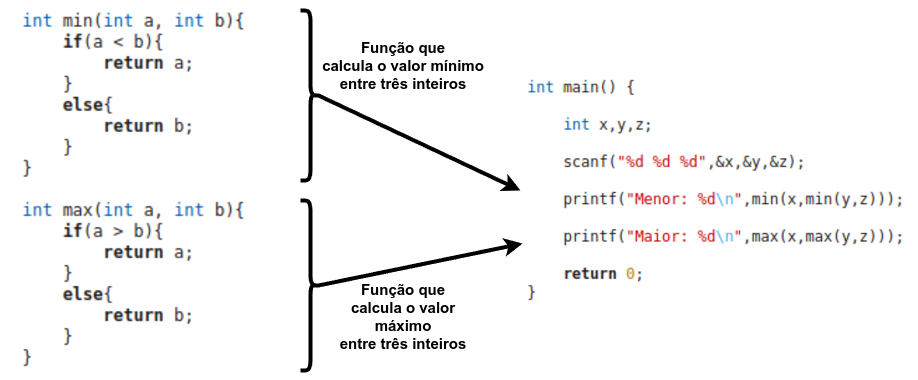

# 5. Funções

Uma **função** (sub-algoritmo) é um bloco de código que realiza uma tarefa específica e pode ser reutilizado em diferentes partes de um programa.

Usar funções em códigos na linguagem C é uma prática importante para tornar o desenvolvimento mais organizado, eficiente e compreensível.

5.1. [Por que usar funções?](justificativa.md)

5.2. [Estrutura de uma Função](estrutura.md)

5.3. [Variáveis e Escopo](escopo.md)

5.4. [Exemplos](exemplos.md)

## Exercícios Resolvidos

5.5. [Beecrowd 2313 - Qual Triângulo](https://judge.beecrowd.com/pt/problems/view/2313) [[Solucão sem Funções](upsolving/beecrowd_2313.c)] [[Solucão com Funções](upsolving/beecrowd_2313_2.c)] 

5.6. [Beecrowd 2409 - Colchão](https://judge.beecrowd.com/pt/problems/view/2409) [[Resolucão](beecrowd_2409.md)] [[Solucão](beecrowd_2409.c)] 

5.7. [Beecrowd 2462 - Voo](https://judge.beecrowd.com/pt/problems/view/2462) [[Resolucão](beecrowd_2462.md)] [[Solucão](beecrowd_2462.c)] 

<!--
## Aula Prática (29/11/2024)

- [Beecrowd 2454 - Fliper](https://judge.beecrowd.com/pt/problems/view/2454) [[Solucão](beecrowd_2454.c)]

- [Beecrowd 1893 - Fases da Lua](https://judge.beecrowd.com/pt/problems/view/1893) [[Solucão](beecrowd_1893.c)]

- [Beecrowd 3454 - Alice no País do Jogo da Velha](https://judge.beecrowd.com/pt/problems/view/3454) [[Solucão](beecrowd_3454.c)]
 
- [Beecrowd 1045 - Tipos de Triângulos](https://judge.beecrowd.com/pt/problems/view/1045) [[Solucão](beecrowd_1045.c)] -->
