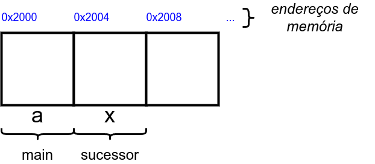
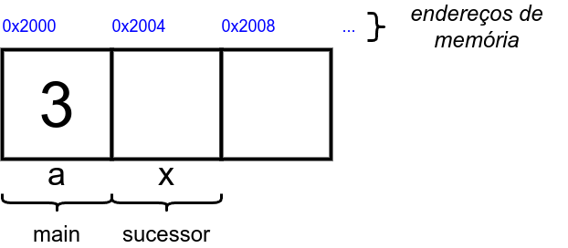
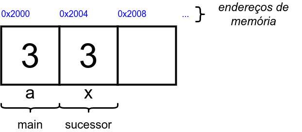
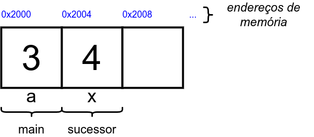
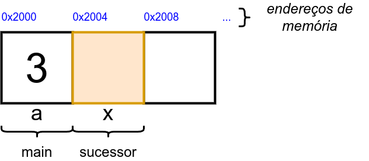

# 5.2. Estrutura de Funções

Em linguagem C, temos funções que retornam valores e que não retornam valores. Vamos começar estudando as funções que retornam valores.

Uma função sempre cuida de funcionalidades e operações específicas. Uma função pode ser chamada quantas vezes forem necessárias no decorrer do código-fonte após a sua definição. Como resultando, ganha-se em abstração do código-fonte, pois a função ```main``` fica mais legível e limpa, sendo possível apresentar o fluxo principal do algoritmo do programa sem detalhes desnecessários.

## Função com Retorno

Uma função com retorno possui a seguinte estrutura:

```
tipo nome_da_funcao(tipo1 var1, tipo2 var2, ... ){
    tipo var;

    /* ... comandos, expressões e instruções da função ... */

    return var;
}
```

- ```tipo``` se refere ao tipo de retorno, que define o tipo do valor que a função devolve ao ser chamada (por exemplo, int, float, void);
- ```nome_da_funcao``` identifica a função e permite chamá-la pelo nome no decorrer do código-fonte;
- Parâmetros ```(tipo1 var1, tipo2 var2, ... )```: são valores que podem ser passados para a função, no formato ```tipo nome_da_variavel``` e separadas por vírgula, para que ela os utilize em seus comandos, expressões e instruções. Você pode definir uma função com diversos parâmetros, ou nenhum, dependendo do problema sendo resolvido;
- Corpo: O bloco de código-fonte entre abre-chaves e fecha-chaves ```{}``` que descreve as operações e os passos efetuados pela função.

**Exemplo 1:** uma função que determina o sucessor de um número:

```
int sucessor(int a){
    int s;
    s = a+1;
    return s;
}
```

**Exemplo 2:** uma função que determina a soma de dois inteiros:

```
int soma(int x, int y){
    int s;
    s = x+y;
    return s;
}
```

**Exemplo 3:** uma função que lê e retorna um valor inteiro - apenas para propósitos didáticos:

```
int leInteiro(){
    int n;

    scanf("%d",&n);

    return n;
}
```

## Chamada da Função

A chamada de uma função é o comando que chama uma função definida previamente em um programa, fazendo com que o código da função seja executado. Durante a chamada, pode-se passar argumentos para a função, permitindo que ela execute operações específicas com base nesses valores.

Uma chamada de função contém:

- Nome da função: identifica qual função será executada. Ela deve estar previamente definida e acessível no código-fonte;
- Argumentos: é o nome que se dá para os valores passados para a função como entrada, dependendo de como os parâmetros da função foram definidos.

Veja o exemplo a seguir:

```
#include<stdio.h>

int f(int x){ // definicao da funcao f
    int y;
    y = x+1;
    return y;
}

int main(){
    int a,b;

    scanf("%d",&a);

    b = f(a); // chamada da função f

    printf("%d\n",b);
    return 0;
}
```

Repare que:

- As linhas 4-7 apresentam a definição da função ```f```, que possui um parâmetro que é um número inteiro. A função retorna um valor inteiro para o local onde foi chamada;
- A linha ```b = f(a);``` apresenta a chamada da função ```f```. Neste momento, o fluxo do código-fonte executa todo os comandos e expressões que estão definidos no corpo da função ```f```. O valor armazenado na variável ```a``` será passado como argumento da função ```f``` em um processo conhecido como **passagem por valor** (veremos mais sobre esse tópico a seguir). Assim o valor armazenado na variável ```a``` da função ```main``` é copiado para a variável ```x``` na função ```f```.

## Função sem Retorno

Quando se necessita criar uma função que não retorna nenhum valor, pode-se defini-la como sendo do tipo **void**. A estrutura de uma função do tipo **void** é a seguinte:

```
void nome_da_funcao( tipo2 var2, tipo3  var3, ... ){
    /* ... faz alguma coisa ... */
}
```

- Uma função sem retorno deve ser definida sempre como sendo o "tipo" **void**.
- ```nome_da_funcao``` identifica a função e permite chamá-la pelo nome no decorrer do código-fonte.
- Parâmetros (opcional): valores que podem ser passados para a função, para que ela os utilize em seu código-fonte.
- Corpo: O bloco de código-fonte entre abre-chaves e fecha-chaves que implementa os comandos, operações e instruções da função.

Então não é necessário colocar o comando ```return```? Exatamente. Em funções **void**, não é necessário colocar o comando ```return```. Em alguns tipos de funções, utiliza-se o ```return ;``` sem explicitar um valor de retorno.

Suponha que queiramos criar uma função que imprime dois valores inteiros *a* e *b*. Podemos então elaborar o seguinte código-fonte:

```
#include<stdio.h>

void imprimeSoma(int a, int b){
    printf("Soma: %d\n",a+b);
}

int main(){
    int x,y;

    scanf("%d %d",&x,&y);

    imprimeSoma(x,y);

    return 0;
}
```

Veja que como o objetivo da função ```imprimeSoma``` é apenas imprimir, não é necessário retornar nenhum valor para a função ```main```, onde ocorre a chamada.

## Passagem por Valor

Passagem por valor é processo em que os valores das variáveis são copiados e passados como argumentos de uma função. Quando uma função recebe um parâmetro por valor, ela trabalha com uma cópia desse valor, e qualquer modificação feita ao parâmetro dentro da função não afeta o valor original na memória fora da função. Em linhas gerais, a função não pode alterar o valor original da variável passada como argumento.

No código-fonte abaixo, temos uma **tentativa incorreta** de determinar o sucessor de uma variável inteira ```a``` por meio da função ```sucessor```:

```
#include<stdio.h>

void sucessor(int x){
    x = x+1;
}

int main(){
    int a;

    scanf("%d",&a);

    sucessor(a);

    printf("%d\n",a);
    return 0;
}
```

Ao executar o código-fonte acima, obtemos a seguinte resposta se digitarmos ```a = 3``` (por exemplo):

```
3
```

Ops! Não era para imprimir 4, que é o sucessor natural de 3? Pois é... veja os gráficos a seguir:

Quando o programa começa a rodar, as variáveis têm seus espaços na memória alocados:



Depois, o comando ```scanf("%d",&a);``` espera que o usuário digite algum valor inteiro. Suponha que o usuário digite 3. Esse valor será armazenado na variável ```a```:



Em seguida, existe a chamada da função ```sucessor(a);```. O valor armazenado em ```a``` é copiado para a variável ```x``` da função ```sucessor```, denotando uma **passagem por valor**, já que essa variáveis são inteiras:



No interior da função ```sucessor```, ocorre então a operação ```x = x+1;```, resultando no valor 4:



Quando a função ```sucessor``` termina, todas as operações feitas em seu interior são perdidas, incluindo o valor da variável ```x```. Repare que o valor da variável ```a``` está inalterado.



