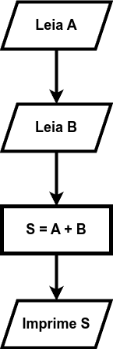
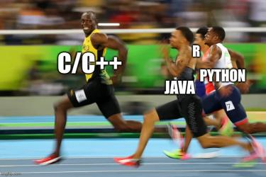

# Introdução aos Algoritmos

## Definição de Algoritmo

Um **algoritmo** é uma sequência finita de passos formulada de maneira lógica para gerar um conjunto de saídas esperadas a partir de um conjunto de dados de entrada. Existem diversas maneiras de representação de um algoritmo, variando-se desde as abordagens mais próximas à nossa linguagem natural até os algoritmos computacionais. Por exemplo, uma representação alto nível de um algoritmo é a abordagem descritiva, que consiste em enumerar um passo-a-passo e descrever textualmente como resolver o problema em questão.

Vale ressaltar que o propósito do algoritmo é sempre o mesmo: descrever uma sequência de passos que fazem sentido a fim de se obter uma saída esperada ao resolver um problema a partir de dados de entrada.

Veja a seguir diferentes representações para o problema de imprimir a soma de dois números que são fornecidos como entrada:

### Algoritmo Descritivo

```
1) Solicite que o usuário informe um número inteiro a por meio do teclado
2) Guarde esse valor na variável a
3) Solicite que o usuário informe um número inteiro b por meio do teclado
4) Guarde esse valor na variável b
5) Some a e b e armazene o resultado na variável s
6) Imprima na tela o valor da variável s
```

### Pseudo-código

```
a <- Ler_Inteiro()
b <- Ler_Inteiro()

s <- a+b

Imprimir(s)
```

### Fluxograma



### Algoritmo computacional


```
a = int(input("Informe o valor do numero a: "))
b = int(input("Informe o valor do numero b: "))

s=a+b
print(f"Soma de a e b eh: {s}")
```


## Para rir

