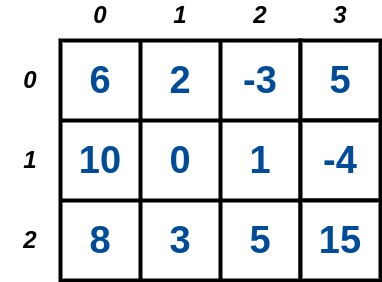
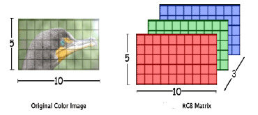

# 9. Matrizes

Uma matriz é um vetor (array) multidimensional, geralmente empregado no armazenamento de dados em forma de tabela. A representação mais simples de uma matriz é por um array bidimensional, isto é, uma estrutura contendo ```N``` linhas por ```M``` colunas como mostra a figura abaixo:



Da mesma maneira do que nos vetores, os índices nas matrizes começam no inteiro ```0```. Assim, cada posição ```a[i][j]``` (ou célula) da matriz é acessada considerado os índices de linha ```i (0 <= i < N)``` e de coluna ```j (0 <= j < M)```.

Outros tipos de matrizes podem apresentar várias dimensões, como é o caso de uma imagem colorida representada pelo modelo de cor RGB (Red-Green-Blue). Nesse caso, cada posição ```a[i][j]``` terá uma profundidade ```3```, associada a cada um dos canais de cores.



Fonte: https://www.researchgate.net/figure/Color-image-and-RGB-matrices_fig1_339435251

9.1. [Fundamentos de Matrizes](definicao.md)

9.2. [Padding de Matrizes](padding.md)

9.3. [Vetores de Strings](vetores_strings.md)

9.4. [Alocação Dinâmica de Matrizes](alocacao_dinamica.md)


# Exercícios Resolvidos

[Beecrowd 1478 - Square Matrix II](https://judge.beecrowd.com/en/problems/view/1478) [[Solução](upsolving/beecrowd_1478.c)]

[Beecrowd 4735 - Campo Minado 2D](https://judge.beecrowd.com/en/custom-problems/view/4735) [[Solução](upsolving/beecrowd_4735.c)]

[Beecrowd 1383 - Sudoku](https://www.beecrowd.com.br/judge/pt/problems/view/1383) [[Solução](upsolving/beecrowd_1383.c)]

<!--
# Aula Prática (12/07/2024)

[Beecrowd 1186 - Abaixo da Diagonal Secundária](https://judge.beecrowd.com/en/problems/view/1186) [[Solução](upsolving/beecrowd_1186.c)]

[Beecrowd 1435 - Matriz Quadrada I](https://judge.beecrowd.com/en/problems/view/1435) [[Solução](upsolving/beecrowd_1435.c)]

[Beecrowd 1652 - Deli Deli](https://judge.beecrowd.com/en/problems/view/1652) [[Solução](upsolving/beecrowd_1652.c)]

[Beecrowd 2552 - CheeseBreadSweeper](https://judge.beecrowd.com/en/problems/view/2552) [[Solução](upsolving/beecrowd_2552.c)]-->
