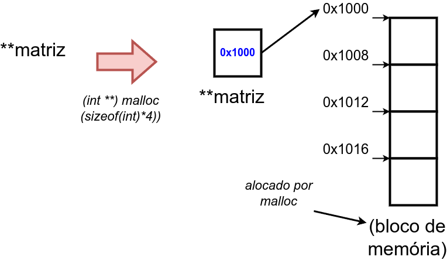
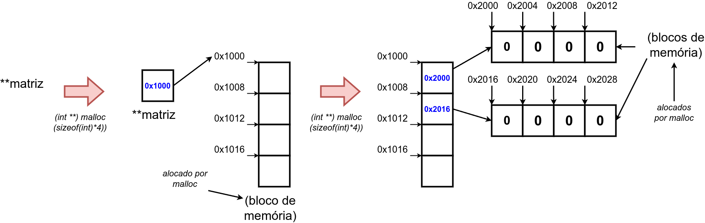

# 9.4. Alocação Dinâmica de Matrizes




```
#include<stdio.h>
#include<stdlib.h>

int main(){
    int n,m;
    double **matriz;

    scanf("%d %d",&n,&m);

    matriz = (int **) malloc (sizeof(double)*n);

    for(i = 0; i < n; i++){
        matriz[i] = (int *) malloc (sizeof(double)*m);
    }

    for(i = 0; i < n; i++){
        for(j = 0; j < m; j++){
          matriz[i][j] = 0;
        }
    }

    for(i = 0; i < n; i++){
        free(matriz[i]);
    }

    free(matriz);

    return 0;
}
```


