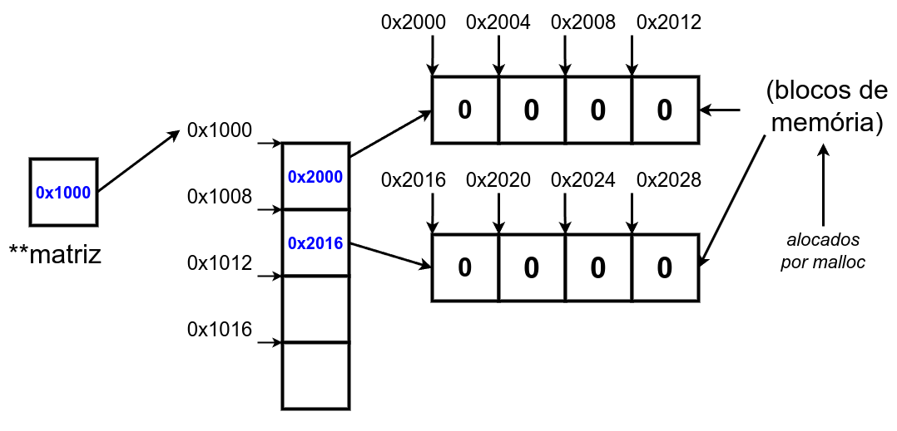
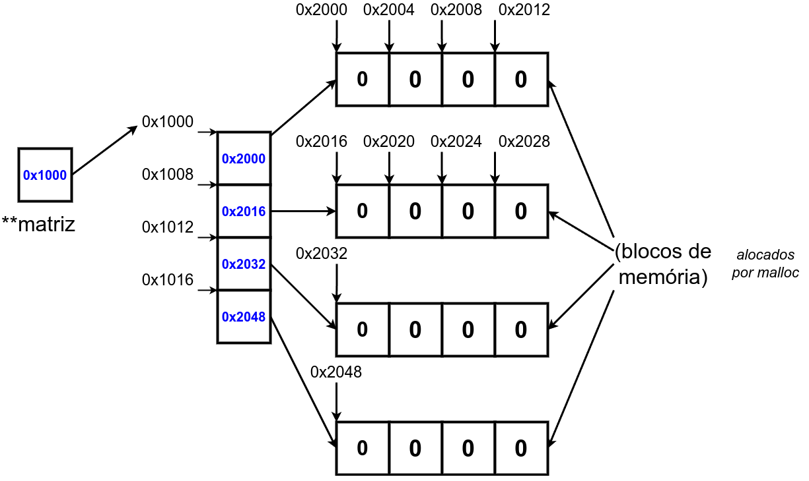

# 9.4. Alocação Dinâmica de Matrizes

Lembre-se de incluir a biblioteca ```stdlib.h``` para uso das funções ```malloc()``` e ```free()```, além do operador ```sizeof```.

```
int n,m;
int **matriz;

n=4;
m=4;
```

Já vamos colocar o comando ```free()```:


```
/* ... */
matriz = (int **) malloc (sizeof(int)*n);

free(matriz);
/* ... */
```

Por fim,



```
/* ... */
matriz = (int **) malloc (sizeof(int)*n);

for(i = 0; i < n; i++){
    matriz[i] = (int *) malloc (sizeof(int)*m);
}

for(i = 0; i < n; i++){
    free(matriz[i]);
}

free(matriz);
/* ... */
```


## 9.4.2. Código-fonte completo



```
#include<stdio.h>
#include<stdlib.h>

int main(){
    int n,m;
    int **matriz;

    scanf("%d %d",&n,&m);

    matriz = (int **) malloc (sizeof(int)*n);

    for(i = 0; i < n; i++){
        matriz[i] = (int *) malloc (sizeof(int)*m);
    }

    for(i = 0; i < n; i++){
        for(j = 0; j < m; j++){
          matriz[i][j] = 0;
        }
    }

    for(i = 0; i < n; i++){
        free(matriz[i]);
    }

    free(matriz);

    return 0;
}
```


