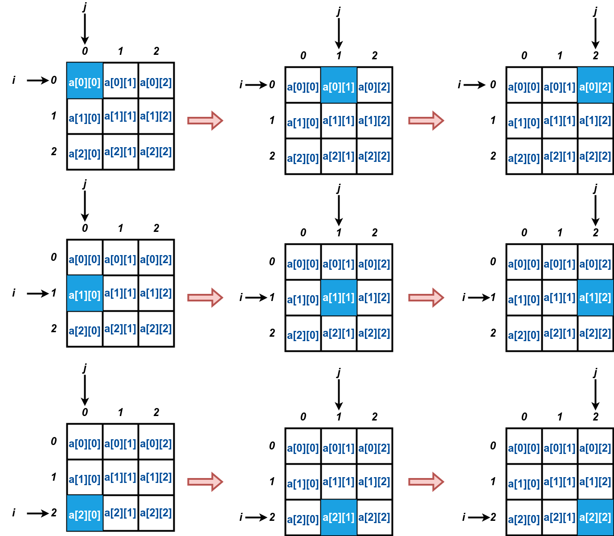

# 9.1. Fundamentos de Matrizes

## Declaração de uma Matriz

Para declarar uma matriz em Linguagem C, você precisa especificar o tipo de dados e as dimensões da matriz como se segue:

```
tipo nome_variavel[NUMERO_DE_LINHAS][NUMERO_DE_COLUNAS];
```

A declaração abaixo cria uma matriz 4 x 4 de números inteiros:

```
int matriz[4][4];
```

enquanto que a declaração abaixo cria uma matriz de caracteres 3 x 5:

```
char vetor_strings[3][5];
```

Podemos também já inicializar uma matriz com alguns valores como mostrado abaixo:

```
int matriz[3][4] = {
    {6, 2, -3, 5},
    {10, 0, 1, -4},
    {8, 3, 5, 15}
};
```

resultando na seguinte matriz:


## Percorrendo uma matriz



## Leitura de uma Matriz na Entrada Padrão
```
#include<stdio.h>
#define MAX_N 100
#define MAX_M 100

int main(){
    int i,j,n,m;
    // declara matriz 100 x 100
    int matriz[MAX_N][MAX_M];

    scanf("%d %d",&n,&m);

    // leitura de n linhas
    for(i = 0; i < n; i++){
        // para cada linha,
        // ler m valores inteiros = colunas!
        for(j = 0; j < m; j++){
            scanf("%d",&matriz[i][j]);
        }
    }
    printf("\nMatriz\n");
    // imprimir a matriz
    for(i = 0; i < n; i++){
        for(j = 0; j < m-1; j++){
            printf("%d ",matriz[i][j]);
        }
        printf("%d\n",matriz[i][m-1]);
    }


    printf("\nDetalhado\n");
    // imprimir a matriz
    for(i = 0; i < n; i++){
        for(j = 0; j < m; j++){
            printf("matriz[%d][%d] <- %d\n",i,j,matriz[i][j]);
        }
        printf("\n");
    }

    return 0;
}
```
