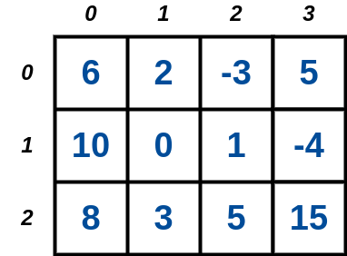

# 9.1. Fundamentos de Matrizes

## Declaração de uma Matriz

Para declarar uma matriz em Linguagem C, você precisa especificar o tipo de dados e as dimensões da matriz como se segue:

```
tipo nome_variavel[NUMERO_DE_LINHAS][NUMERO_DE_COLUNAS];
```

A declaração abaixo cria uma matriz 4 x 4 de números inteiros:

```
int matriz[4][4];
```

enquanto que a declaração abaixo cria uma matriz de caracteres 3 x 5:

```
char vetor_strings[3][5];
```

Podemos também já inicializar uma matriz com alguns valores como mostrado abaixo:

```
int matriz[3][4] = {
    {6, 2, -3, 5},
    {10, 0, 1, -4},
    {8, 3, 5, 15}
};
```

resultando na seguinte matriz:



## Declaração Genérica

```
#include<stdio.h>
#define MAX_N 100
#define MAX_M 100

int main(){
    int i,j,n,m;

    // declara matriz 100 x 100
    int matriz[MAX_N][MAX_M];

    return 0;
}
```

## Acessando Elementos (Células)

O trecho de código-fonte abaixo mostra como acessar uma posição específica de uma matriz. No exemplo, estamos acessando a célula que está na linha de índice 2 e a coluna de índice 1 da matriz, atribuindo o resultado na variável inteira ```elemento```:

```
int elemento;
int matriz[3][3] = {7,3,1,9,11,-4,0,1,4};

elemento = matriz[2][1];
```

Já no trecho de código-fonte abaixo, estamos atribuindo o valor ```6``` para a célula da matriz que está no índice de linha 1 e no índice de coluna 1:

```
int matriz[2][2] = {0,1,2,3};

matriz[1][1] = 6;

printf("%d\n",matriz[1][1]);
```

## Percorrendo uma matriz

Para percorrer célula por célula de uma matriz, precisaremos de um laço ```for``` para iterarmos sobre as linhas da matriz e um outro laço **interno** ``for`` para iterar sobre as colunas. Com isso, podemos dizer que *"para cada linha, acessamos o elemento que está em cada coluna"* da matriz. Veja a ilustração desse processo na imagem abaixo:


O trecho de código-fonte que faz isso é apresentado abaixo:

```
    /* ... */
    int i,j,n,m,elemento;

    for(i = 0; i < n; i++){
        for(j = 0; j < m; j++){
            elemento = matriz[i][j]; // pega o elemento da matriz
        }
    }
    /*...*/
```

## Leitura de uma Matriz na Entrada Padrão

Nos juízes online, será comum termos que ler da entrada padrão uma matriz de ```n``` linhas por ```m``` colunas, sendo que o valor de ```n``` é no máximo ```N```, enquanto que o valor de ```m``` é no máximo ```M```. Para isso, vamos definir os rótulos MAX_N e MAX_M para expressarem as quantidades máximas de linhas e colunas que a matriz pode ter, dependendo do problema.

```
#include<stdio.h>
#define MAX_N 100
#define MAX_M 100

int main(){
    int i,j,n,m;
    // declara matriz 100 x 100
    int matriz[MAX_N][MAX_M];

    scanf("%d %d",&n,&m);

    // leitura de n linhas
    for(i = 0; i < n; i++){
        // para cada linha,
        // ler m valores inteiros = colunas!
        for(j = 0; j < m; j++){
            scanf("%d",&matriz[i][j]);
        }
    }
    printf("\nMatriz\n");
    // imprimir a matriz
    for(i = 0; i < n; i++){
        for(j = 0; j < m-1; j++){
            printf("%d ",matriz[i][j]);
        }
        printf("%d\n",matriz[i][m-1]);
    }


    printf("\nDetalhado\n");
    // imprimir a matriz
    for(i = 0; i < n; i++){
        for(j = 0; j < m; j++){
            printf("matriz[%d][%d] <- %d\n",i,j,matriz[i][j]);
        }
        printf("\n");
    }

    return 0;
}
```

## Escrita (Impressão) de uma Matriz na Entrada Padrão

Também nos juízes online, algumas vezes devemos imprimir uma matriz na saída padrão. Considerando que temos uma matriz ```n``` x ```m```, devemos percorrer a matriz como explicado anteriormente e imprimir cada elemento, em que a formatação deve consistir do inteiro correspondente ao elemento seguido de um espaço branco. Devemos fazer isso com exceção dos elementos que estão na última coluna, em que após o inteiro correspondente à essa celula, devemos colocar o caractere ```'\n'```.

```
#include<stdio.h>
#define MAX_N 100
#define MAX_M 100

int main(){
    int i,j,n,m;
    // declara matriz 100 x 100
    int matriz[MAX_N][MAX_M];

    scanf("%d %d",&n,&m);

    /* leitura da matriz da entrada padrao*/
    for(i = 0; i < n; i++){
        for(j = 0; j < m; j++){
            scanf("%d",&matriz[i][j]);
        }
    }

    printf("\nMatriz\n");

    for(i = 0; i < n; i++){
        for(j = 0; j < m-1; j++){
            printf("%d ",matriz[i][j]);
        }
        printf("%d\n",matriz[i][m-1]);
    }

    return 0;
}
```

