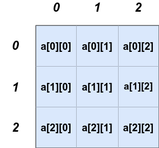
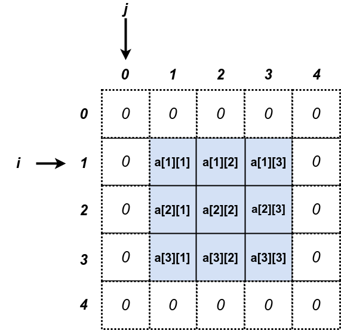
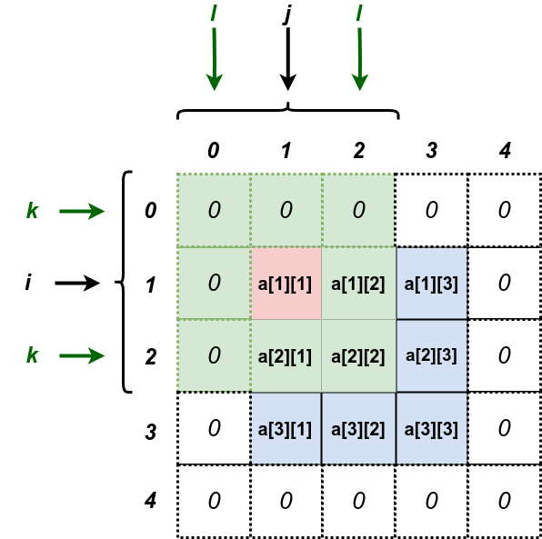

# 9.3. Padding de Matrizes

*Padding* é uma técnica que adiciona bordas extras de uma matriz, aumentando-se as dimensões da matriz original ao adicionar linhas e colunas extras, normalmente preenchidas com zeros, valores constantes ou replicações dos valores da borda da matriz original.

Suponha a seguinte matriz de inteiros 3x3 original:



Fazendo-se o *padding* de tamanho 1 na matriz acima, isto é, adicionando-se uma linha de zeros no topo da matriz, uma outra linha de zeros na parte de baixo da matriz, uma coluna de zeros na borda esquerda e outra coluna de zeros na borda direita resulta em:



## 9.3.1. Como fazer o Padding


```
#include<stdio.h>
#define MAX_N 100
#define MAX_M 100

int main(){

    int n,m,i,j;
    int matriz[MAX_N+2][MAX_M+2];

    scanf("%d %d",&n,&m);

    for(i = 0; i < n+2; i++){
        for(j = 0; j < m+2; j++){
            matriz[i][j] = 0;
        }
    }

    for(i = 1; i <= n; i++){
        for(j = 1; j <= m; j++){
            scanf("%d",&matriz[i][j]);
        }
    }
  
    return 0;
}
```

## Análise de Vizinhança

Padding permite que os filtros (ou kernels) possam ser aplicados a todos os pixels da imagem original, incluindo os pixels na borda. Sem padding, a análise de vizinhança não é possível para os pixels na borda, pois não há pixels adicionais para completar a vizinhança necessária para a operação.



```
#include<stdio.h>
#define MAX_N 100
#define MAX_M 100

int main(){

    int n,m,i,j;
    int matriz[MAX_N+2][MAX_M+2];

    scanf("%d %d",&n,&m);

    for(i = 0; i < n+2; i++){
        for(j = 0; j < m+2; j++){
            matriz[i][j] = 0;
        }
    }

    for(i = 1; i <= n; i++){
        for(j = 1; j <= m; j++){
            scanf("%d",&matriz[i][j]);
        }
    }
  
    return 0;
}
```

