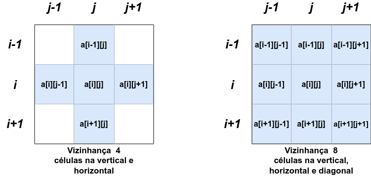

# 9.2. Padding de Matrizes

*Padding* é uma técnica que adiciona bordas extras de uma matriz, aumentando-se as dimensões da matriz original ao adicionar linhas e colunas extras, normalmente preenchidas com zeros, valores constantes ou replicações dos valores da borda da matriz original.

Suponha a seguinte matriz de inteiros 3x3 original:


Fazendo-se o *padding* de tamanho 1 na matriz acima, isto é, adicionando-se uma linha de zeros no topo da matriz, uma outra linha de zeros na parte de baixo da matriz, uma coluna de zeros na borda esquerda e outra coluna de zeros na borda direita resulta em:


Observe que o domínio da matriz 3x3 é agora válido nos índices de linha e de coluna no intervalo fechado ```[1,3]```, pois as linhas e as colunas nos índices 0 e 4 correspondem às bordas extras que não fazem parte da matriz original. Veja que as células válidas da matriz tiveram seus índices atualizados na figura.

## 9.2.1. Como fazer o Padding

Para fazer o padding na matriz, basta adicionar mais duas linhas e duas colunas no momento de definir as dimensões da matriz como se segue:

```
#include<stdio.h>
#define MAX_N 100
#define MAX_M 100

int main(){

    int n,m,i,j;
    int matriz[MAX_N+2][MAX_M+2];    // +2 adiciona mais duas linhas e duas colunas

    scanf("%d %d",&n,&m);

    for(i = 0; i < n+2; i++){
        for(j = 0; j < m+2; j++){
            matriz[i][j] = 0;
        }
    }
  
    return 0;
}
```

Para percorrer a matriz com *padding* nas posições válidas, começamos sempre dos índices ```1``` nas linhas e nas colunas (veja ```i = 1``` e ```j = 1```), indo até ```i <= n``` e ```j <= m``` como mostra o trecho de código-fonte abaixo:

```
/* ... */
for(i = 1; i <= n; i++){
    for(j = 1; j <= m; j++){
        scanf("%d",&matriz[i][j]);
    }
}
/* ... */
```

## 9.2.2. Análise de Vizinhança

O uso do *padding* também permite que possamos analisar as células vizinhas em relação a uma célula "central" na posição genérica **[i][j]** sem nos preocuparmos em verificar se estamos ultrapassando os limites válidos da matriz original. Define-se uma célula vizinha (ou adjacente) a uma célula na posição **[i][j]** como uma célula que possui fronteiras apenas na vertical e na horizontal (também chamada de vizinhança com conectividade 4) e, às vezes, na diagonal (vizinhança com conectividade 8).



Observe no exemplo abaixo em que analisamos todas as células vizinhas em relação a uma célula central na posição  **[i][j]** (célula na cor vermelha). Para isso, utilizamos duas variáveis inteiras adicionais ```k``` e ```l``` para controlarem o percorrimento das linhas e colunas apenas na vizinhança (células em verde):


Por exemplo, podemos somar todos os valores da vizinhança para cada posição **[i][j]** da matriz. O processo é apresentado no código-fonte abaixo:

```
/* ... */
for(i = 1; i <= n; i++){
    for(j = 1; j <= m; j++){

        soma = 0;

        for(k = i-1; k <= i+1; k++){
            for(l = j-1; l <= j+1; l++){
                soma += matriz[k][l];
            }
        }

        printf("%d ");
    }
    printf("\n");
}
/* ... */
```

