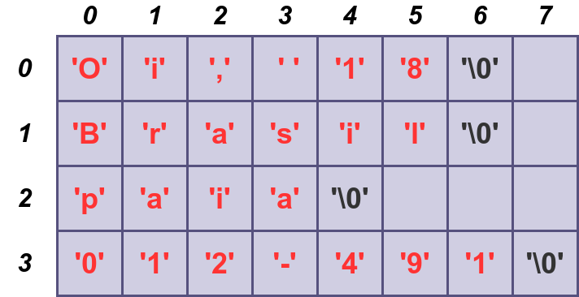

# 9.3. Vetores de Strings 

Em Linguagem C, um vetor de strings pode ser representado estruturalmente por uma matriz de caracteres, em que cada linha dessa matriz denota uma string, que é uma sequência de caracteres terminada por um caractere de fim de string (```'\0'```). Assim, as colunas dessa matriz descrevem os caracteres de cada string. A imagem abaixo ilustra essa estrutura:



## 9.3.1. Declarando uma matriz de caracteres

A declaração a seguir mostra uma matriz de caracteres, contendo ```100``` linhas, com capacidade de armazenar até **100** strings, cada uma com comprimento máximo de **1000** caracteres.

```
char vetor_str[100][1001];
```

Genericamente, tem-se que:

```
#include<stdio.h>
#define MAX_N 100
#define MAX_M 100

int main(){
    int i,j,n,m;
    /* armazena ateh MAX_N strings, cada string contendo ateh MAX_M caracteres */
    char vetor_str[MAX_N][MAX_M+1];

    return 0;
}
```

## 9.3.2. Leitura uma matriz de caracteres

O código-fonte a seguir realiza a leitura de ```n``` strings da entrada padrão (```n <= MAX_N```), em que cada string é apresentada em uma única linha e **não** possui espaços em branco. Observe que temos que usar a função ```getchar()``` para nos livrarmos do caractere ```'\n'``` que fica no Buffer de Entrada/Saída (*Buffer I/O*) para lermos corretamente os caracteres válidos das strings: 

```
#include<stdio.h>
#define MAX_N 100
#define MAX_M 100

int main(){
    int i,j,n,m;

    char vetor_str[MAX_N][MAX_M+1];

    scanf("%d",&n);
    getchar(); 

    for(i = 0; i < n;i++){
        scanf("%s",vetor_str[i]);
        getchar();
    }

    for(i = 0; i < n; i++){
        printf("%s\n",vetor_str[i]);
    }

    return 0;
}
```
