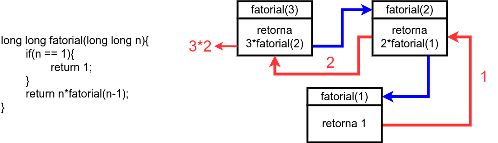

# 11. Recursividade

**Recursividade** é uma técnica para resolução de problemas em programação em que uma função chama a si mesma dentro do seu escopo. Trata-se de uma estratégia para resolver um problema analisando-os como subproblemas e em várias etapas, criando-se um processo de repetição de chamadas da própria função dentro dela mesma.

  

A recursividade costuma deixar o código-fonte mais limpo e próximo da definição matemática do problema e torna a implementação mais fácil em problemas que envolvem recorrência, como fatoriais, algoritmos de ordenação e busca completa.

## Conteúdo

11.1. [Estrutura](estrutura.md)

11.2. [Fibonacci](fibonacci.md)

11.3. [Greatest Common Divisor](gcd.md)

11.4. (Extra) [Merge Sort](mergesort.md)

## Exercícios Resolvidos

11.5. [Beecrowd 2166 - Square Root of 2](https://judge.beecrowd.com/en/problems/view/2166) [[Solução](upsolving/beecrowd_2166.c)]

11.6. [Beecrowd 1512 - Tiles](https://judge.beecrowd.com/en/problems/view/1512) [[Solução](upsolving/beecrowd_1512.c)]

