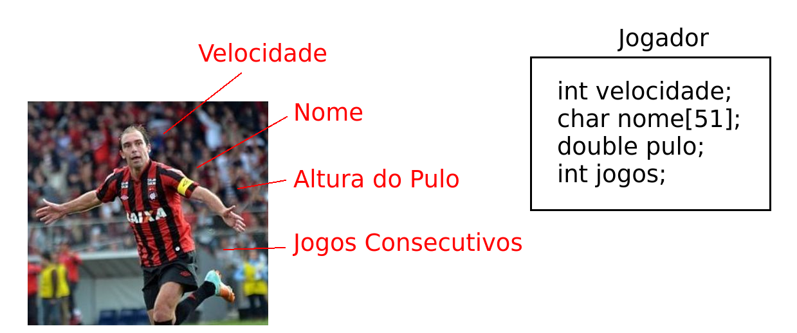

# 12. Estruturas Heterogêneas (Registros)

Um registro (ou estrutura, ou *struct*) é um conjunto de variáveis agrupadas sob um único nome, permitindo o armazenamento de diferentes tipos de dados em uma única amostra (objeto, instância, ou entidade). Um registro facilita a organização e a manipulação de dados complexos, proporcionando uma maneira eficiente de agrupar dados relacionados.

## Tópicos

[12.1. Criando Estruturas](definicao.md)

[12.2. Estruturas por Alocação Dinâmica](dynamic_structs.md)

## Exercícios Resolvidos

[Beecrowd 2312 - Quadro de Medalhas](https://judge.beecrowd.com/en/problems/view/2312) [Solução](upsolving/beecrowd_2312.c)

[Beecrowd 1251 - Tell me the Frequencies!](https://judge.beecrowd.com/en/problems/view/1251) [Solução](upsolving/beecrowd_1251.c)
