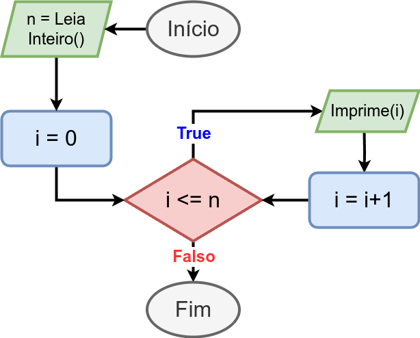

# 6. Estruturas de Repetição

Uma estrutura de repetição permite que blocos de comandos, expressões e instruções (ou, simplesmente, bloco de código) sejam executados repetidas vezes enquanto uma condição for verdadeira.

A Linguagem C contempla as seguintes estruturas de repetição:

6.1. [Fundamentos de Operadores](operadores.md)

6.2. [Laço While](while.md)

6.3. [Laço For](for.md)

## Exercícios Resolvidos

6.4. (While) [Beecrowd 1585 - Making Kites](https://judge.beecrowd.com/en/problems/view/1585) [[Solucão](beecrowd_1585.c)]

6.5. (While) [Beecrowd 1247 - Coast Guard](https://judge.beecrowd.com/pt/problems/view/1071) [[Solucão](beecrowd_1247.c)]

6.6. (While) [Beecrowd 3214 - Refrigerante](https://judge.beecrowd.com/pt/problems/view/3214) [[Solucão](beecrowd_3214.c)]

6.7. (While-For) [Beecrowd 2297 - Bafo](https://judge.beecrowd.com/en/problems/view/2297) [[Solucão While](beecrowd_2297.c)] [[Solucão For](beecrowd_2297_for.c)]

6.8. (For) [Beecrowd 3058 - Supermercado](https://judge.beecrowd.com/en/problems/view/3058) [[Solução](upsolving/beecrowd_3058.c)]

6.9. (For) [Beecrowd 1366 - Sticks Game](https://judge.beecrowd.com/en/problems/view/1366) [[Solucão](beecrowd_1366.c)]

## Aula Prática 1 (23/05/2025)

6.10. [Beecrowd 2862 - Inseto!](https://judge.beecrowd.com/pt/problems/view/2862) [[Solucão](beecrowd_2862.c)]

6.11. [Beecrowd 1387 - Og](https://judge.beecrowd.com/pt/problems/view/1387) [[Solucão](beecrowd_1387.c)]

6.12. [Beecrowd 1397 - Game of The Greatest](https://judge.beecrowd.com/pt/problems/view/2568) [[Solucão](beecrowd_1397.c)]

6.13. [Beecrowd 1103 - Alarm Clock](https://judge.beecrowd.com/pt/problems/view/3084) [[Solucão](beecrowd_1103.c)]

6.14. [Beecrowd 1091 - Division of Nlogonia](https://judge.beecrowd.com/pt/problems/view/2247) [[Solucão](beecrowd_1091.c)]

6.14. [Beecrowd 2247 - Cofrinhos da Vó Vitória](https://judge.beecrowd.com/pt/problems/view/2247) [[Solucão](beecrowd_2247.c)]

## Aula Prática 2 (30/05/2025)

6.15. [Beecrowd 1329 - Head or Tail](https://judge.beecrowd.com/pt/problems/view/1329) [[Solucão](upsolving/beecrowd_1329.c)]

6.16. [Beecrowd 3068 - Meteoros](https://judge.beecrowd.com/pt/problems/view/3068) [[Solucão](beecrowd_3068.c)]

<!--
## Aula Prática 2 (20/12/2024)

6.11. [Beecrowd 3076 - Exercício de História](https://judge.beecrowd.com/pt/problems/view/3076) [[Solucão](beecrowd_3076.c)]

6.12. [Beecrowd 2568 - Ações](https://judge.beecrowd.com/pt/problems/view/2568) [[Solucão](beecrowd_2568.c)]

6.13. [Beecrowd 3084 - Relógio Antigo](https://judge.beecrowd.com/pt/problems/view/3084) [[Solucão](beecrowd_3084.c)]

6.14. [Beecrowd 2247 - Cofrinhos da Vó Vitória](https://judge.beecrowd.com/pt/problems/view/2247) [[Solucão](beecrowd_2247.c)]

6.15. [Beecrowd 1071 - Soma de Impares Consecutivos I](https://judge.beecrowd.com/pt/problems/view/1071) [[Solucão](beecrowd_1071.c)]

6.16. [Beecrowd 1072 - Intervalo 2](https://judge.beecrowd.com/pt/problems/view/1072) [[Solucão](beecrowd_1072.c)]

6.17. [Beecrowd 1329 - Head or Tail](https://judge.beecrowd.com/pt/problems/view/1329) [[Solucão](upsolving/beecrowd_1329.c)]

6.18. [Beecrowd 3432 - Intercepting Information](https://judge.beecrowd.com/pt/problems/view/3432) [[Solucão](upsolving/beecrowd_3432.c)]

6.19. [Beecrowd 3068 - Meteoros](https://judge.beecrowd.com/pt/problems/view/3068) [[Solucão](beecrowd_3068.c)]

6.20. [Beecrowd 1366 - Sticks Game](https://judge.beecrowd.com/pt/problems/view/1366) [[Solucão](upsolving/beecrowd_1366.c)]

6.21. [Beecrowd 3445 - Daily Trips](https://judge.beecrowd.com/pt/problems/view/3445) [[Solucão](upsolving/beecrowd_3445.c)]-->

