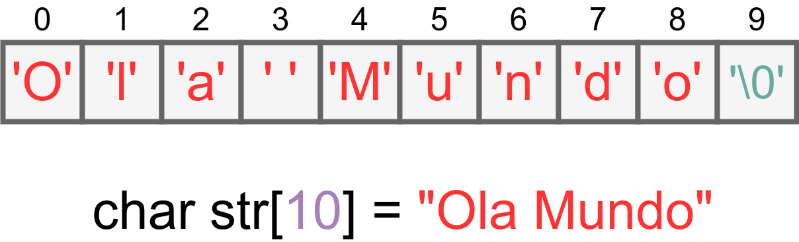

# 8. Strings

Strings são sequências de caracteres terminadas por um caractere especial: o nulo (```\0```). Elas não são um tipo de dado nativo da linguagem como em linguagens mais modernas (ex.: Python ou Java). Em vez disso, strings em C são representadas como vetores de caracteres.

<br><br>

8.1. [Representando e Lendo Strings](representacao.md)

8.2. [Tabela ASCII](ascii.md)

8.3. [Operações com Strings](operacoes.md)

8.4. [Biblioteca String.h](stringh.md)


# Exercícios Resolvidos

8.5. [Beecrowd 2866 - Cryptotext](https://www.beecrowd.com.br/judge/en/problems/view/2866) [[Solução](upsolving/beecrowd_2866.c)]

8.6. [Beecrowd 1168 - LED](https://judge.beecrowd.com/en/problems/view/1168) [[Solução](upsolving/beecrowd_1168.c)]

8.7. [Beecrowd 1024 - Criptografia](https://www.beecrowd.com.br/judge/pt/problems/view/1024) [[Resolução](upsolving/beecrowd_1024.md)] [[Solução](upsolving/beecrowd_1024.c)]

# Aula Prática (17/01/2025)

8.8. [Beecrowd 1253 - Caesar Cipher](https://www.beecrowd.com.br/judge/en/problems/view/1253) [[Solução](upsolving/beecrowd_1253.c)]

8.9. [Beecrowd 1234 - Dancing Sentence](https://www.beecrowd.com.br/judge/en/problems/view/1234) [[Solução](upsolving/beecrowd_1234.c)] [[Solução Alternativa](beecrowd_1234.c)]

8.10. [Beecrowd 1607 - Avance as Letras](https://www.beecrowd.com.br/judge/en/problems/view/1607) [[Solução](beecrowd_1607.c)]

8.11. [Beecrowd 1272 - Hidden Message](https://www.beecrowd.com.br/judge/en/problems/view/1272) [[Solução](upsolving/beecrowd_1272.c)]

8.12. [Beecrowd 1235 - De dentro para fora](https://www.beecrowd.com.br/judge/en/problems/view/1235) [[Solução](beecrowd_1235.c)]

8.13. [Beecrowd 2167 - Falha do Motor](https://www.beecrowd.com.br/judge/en/problems/view/2167) [[Solução](beecrowd_2167.c)]

8.14. [Beecrowd 2311 - Saltos Ornamentais](https://www.beecrowd.com.br/judge/en/problems/view/2311) [[Solução](beecrowd_2311.c)]
