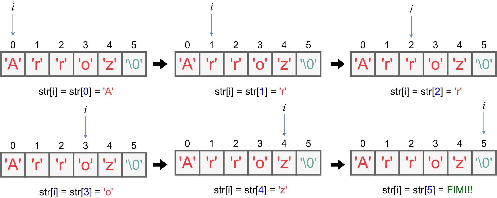

# 8.3 Operações com Strings

## Percorrer uma String

Para se percorrer uma string até o último caractere válido (não é o caractere nulo ```'\0'```), deve-se fazer como nos vetores:

1- Declare uma variável inteira para corresponder a cada índice da string. Vamos chamar essa variável de ```i```;<br>
2- Comece com ```i=0```;<br>
3- Verifique se ```str[i] != \0```. Caso essa condição seja falsa, finalizamos o percorrimento da string. Caso contrário, vá para o passo 4.<br>
4- Se chegou aqui, é porque você está acessando uma posição que contém um caractere da string. Vamos imprimir ele apenas para vê-lo.<br>
5- Incremente a variável ```i```, isto é, faça ```i++```.<br>
6- Volte ao passo 3.<br>

```
#include<stdio.h>
#define MAX_N 1000

int main(){
    char str[MAX_N+1]; // coloca o caractere '\0'
    int n,i;

    scanf("[^\n]",str);

    i = 0;
    while(str[i]!='\0'){
        printf("str[%d] => %c\n",i,str[i]);
        i++;
    }

    return 0;
}
```

Se digitarmos a string ```"Arroz"```, a saída para o programa acima será:

```
str[0] => A
str[1] => r
str[2] => r
str[3] => o
str[4] => z
```

Mas o que ocorre?



## Comparar Duas Strings

A comparação em Linguagem C é feita de maneira **lexicográfica**. Vamos implementar uma função que compara as duas strings ```str1``` e ```str2``` seguindo a convenção:

- Retorna ```0``` se as strings são iguais.
- Retorna ```< 0``` se ```str1``` é menor que ```str2``` (ordem lexicográfica).
- Retorna ```> 0``` se ```str1``` é maior que ```str2```.

### Péssima prática de programação

Obs.: em linguagem C, duas strings não podem ser comparadas diretamente com os operadores ==, !=, <, >, como em outras linguagens de alto nível (como Python). Logo, é **errado** fazer como o código-fonte abaixo:

```
/* ... isso aqui eh errado */
char a[3] = "abc";
char b[3] = "abx";

if (a == b) {
    // isso nao funciona!!!
}
```

 Outra possibilidade é utilizar a função ```strcmp()``` da biblioteca string.h. Veja mais detalhes [aqui](../stringh.md).

## Verificar se uma String está Contida em outra String

