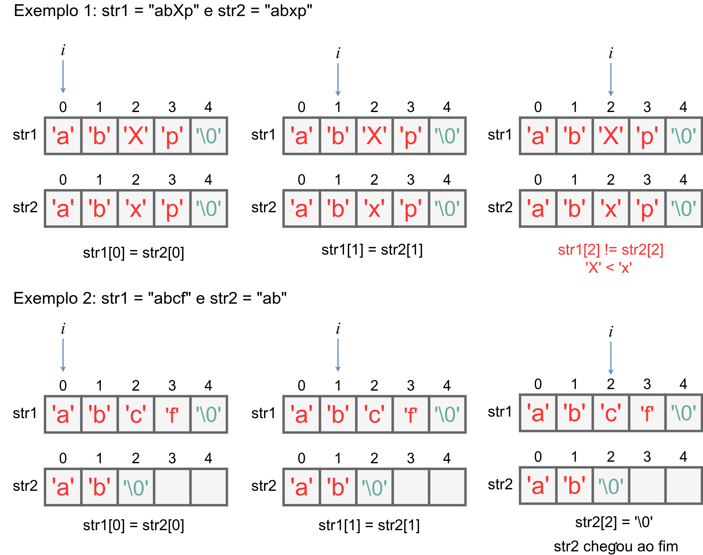

# 8.3 Operações com Strings

## Percorrer uma String

Para se percorrer uma string até o último caractere válido (não é o caractere nulo ```'\0'```), deve-se fazer como nos vetores:

1- Declare uma variável inteira para corresponder a cada índice da string. Vamos chamar essa variável de ```i```;<br>
2- Comece com ```i=0```;<br>
3- Verifique se ```str[i] != \0```. Caso essa condição seja falsa, finalizamos o percorrimento da string. Caso contrário, vá para o passo 4.<br>
4- Se chegou aqui, é porque você está acessando uma posição que contém um caractere da string. Vamos imprimir ele apenas para vê-lo.<br>
5- Incremente a variável ```i```, isto é, faça ```i++```.<br>
6- Volte ao passo 3.<br>

```
#include<stdio.h>
#define MAX_N 1000

int main(){
    char str[MAX_N+1]; // coloca o caractere '\0'
    int n,i;

    scanf("[^\n]",str);

    i = 0;
    while(str[i]!='\0'){
        printf("str[%d] => %c\n",i,str[i]);
        i++;
    }

    return 0;
}
```

Se digitarmos a string ```"Arroz"```, a saída para o programa acima será:

```
str[0] => A
str[1] => r
str[2] => r
str[3] => o
str[4] => z
```

Mas o que ocorre?


## Comparar Duas Strings

A comparação em Linguagem C é feita de maneira **lexicográfica**. Sejam duas strings ```str1``` e ```str2```. Na comparação lexicográfica, compara-se os códigos ASCII de cada caractere na Vamos implementar uma função que compara as duas strings ```str1``` e ```str2``` seguindo a convenção:

- Retorna ```0``` se as strings são iguais.
- Retorna ```< 0``` se ```str1``` é menor que ```str2``` (ordem lexicográfica).
- Retorna ```> 0``` se ```str1``` é maior que ```str2```.

Exemplos:
1) ```str1 = "abc"``` e ```str2 = "aB"``` . Nesse caso, ```str1 > str2```, pois na segunda posição, o código ASCII de ```b``` (em ```str1```) é 98, sendo então maior do que o código ASCII de ```B``` (em ```str2```), que é 66.
2) ```str1 = "p46gbn"``` e ```str2 = "p46gbn"``` . Aqui temos que ```str1 = str2```, pois todos os seus caracteres das strings são iguais.
3) ```str1 = "abcde"``` e ```str2 = "abcdef"``` . Vemos que ```str1 < str2```, pois ```str1``` e ```str2``` apresentam o mesmo prefixo "abcde", mas ```str2``` possui o caractere *f* ao final.





Vamos implementar uma função que realiza essa comparação.

```
#include<stdio.h>

int min(int a, int b){
    if(a < b){
        return a;
    } else {
        return b;
    }
}

int strlen_fake(char string[1001]){
    int i;
    i = 0;
    while(string[i] != '\0'){
        i++;
    }
    return i;
}

int strcmp_fake(char str1[1001], char str2[1001]){
    int i,n,m;

    n = strlen_fake(str1);
    m = strlen_fake(str2);

    for(i = 0; i < n && i < m; i++){
        if(str1[i] > str2[i]){
            return i+1;
        } else {
            if(str1[i] < str2[i]){
                return -(i+1);
            }
        }
    }

    if(i == m && i == n){
        return 0;
    } else {
        if(i == n){
            return -(i+1);
        } else {
            return (i+1);
        }
    }
}

int main(){
    char a[1001],b[1001];
    int n,m,ans;

    scanf("%s %s",a,b);

    ans = strcmp_fake(a,b);

    if(ans == 0){
        printf("Strings sao iguais\n");
    } else {
        if(ans < 0){
            printf("str1 < str2 em %d\n",ans+1);
        } else {
            printf("str1 > str2 em %d\n",ans-1);
        }

    }

    return 0;
}
```


### Péssima prática de programação

Obs.: em linguagem C, duas strings não podem ser comparadas diretamente com os operadores ==, !=, <, >, como em outras linguagens de alto nível (como Python). Logo, é **errado** fazer como o código-fonte abaixo:

```
/* ... isso aqui eh errado */
char a[3] = "abc";
char b[3] = "abx";

if (a == b) {
    // isso nao funciona!!!
}
```

 Outra possibilidade é utilizar a função ```strcmp()``` da biblioteca string.h. Veja mais detalhes [aqui](stringh.md).

## Verificar se uma String é substring de outra String

**Definição:** uma substring é uma sequência contínua de caracteres que está contida dentro de outra string.

O objetivo é verificar se uma string ```str1``` é substring de uma string ```str2```, em que |str1| <= |str2| (|A| é a cardinalidade da string A, isto é, a quantidade de caracteres desconsiderando o caractere ```'\0'```).

- A string "sol" é substring de "O sol está brilhando"
- A string "chuva" **não é** substring de "O sol está brilhando"
- A string "123" é substring de "abc123def"

Vamos criar uma função que verifica se ```str1``` está dentro de ```str2```. ```str1``` é a string que queremos encontrar em ```str2```. Por simplicidade, colocaremos o tamanho máximo das strings como sendo *1000*.

```
int strstr_fake(char str1[1001], char str2[1001])
```

A ideia é comparar sempre ```str1[0]``` com ```str2[i]```, para *i=0,1,2,...,m-1*, com ```m=strlen(str2)```. Caso seja ```str1[0] = str2[i]```, repetimos esse processo para```str1[1]``` e ```str2[i+1]```, ```str1[2]``` e ```str2[i+2]```, e assim por diante, enquanto ```i < m``` e ```j < n``` e ```str2[i+j] = str1[j]```. A variável ```j``` faz esse papel de caminhar pela ```str1``` enquanto ```str1[j] = str2[k]```, para *k=i,i+1,...,m-1* e *j=0,1,2,...,n-1*, para ```n=strlen(str2)```.

```
#include<stdio.h>
#include<string.h>

int strstr_fake(char str1[1001], char str2[1001]){
    int i,j,k,l,n,m;

    n = strlen(str1);
    m = strlen(str2);

    for(i = 0; i < m; i++){
        
        j = 0;
        k = i;
        
        while(j < n && k < m && str1[j] == str2[k]){
            k++;
            j++;
        }
        
        if(j == n){
            return i;
        }
    }
    return -1;
}

int main(){
    char a[1001],b[1001];
    int ans;

    scanf("%s",a);
    scanf("%s",b);

    ans = strstr_fake(a, b);

    if(ans < 0){
        printf("Nao\n");
    } else {
        printf("Sim, a partir da posicao %d em str2.\n",ans);
    }
    return 0;
}
```
